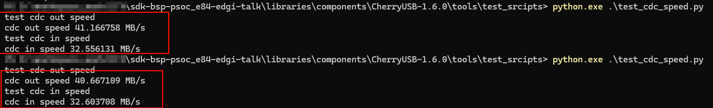

# Edgi_Talk_M33_USB_D CherryUSB Example Project

[**中文**](./README_zh.md) | **English**

## Overview

This project integrates **CherryUSB** on the **M33 core** of the Edgi-Talk board. It is prepared for **USB device mode** and uses the Infineon **DWC2** IP.

## Default Configuration

* `RT_USING_CHERRYUSB = y`
* `RT_CHERRYUSB_DEVICE = y`
* `RT_CHERRYUSB_DEVICE_SPEED_HS = y`
* `RT_CHERRYUSB_DEVICE_DWC2_INFINEON = y`
* Device template: **CDC** (user application)

## Build and Flash

1. Build the project in RT-Thread Studio or with SCons.
2. Flash the firmware via KitProg3 (DAP).
3. Connect the Type-C USB port for device enumeration.
4. Use CherryUSB test scripts to benchmark the CDC device. The test result is shown below:



## Configuration (Switching Modes)

Open RT-Thread Studio and go to:

```
RT-Thread Settings -> USB -> CherryUSB
```

* **Device mode**: enable `RT_CHERRYUSB_DEVICE`, select device IP under **CHERRYUSB_DEVICE_IP** (default: `RT_CHERRYUSB_DEVICE_DWC2_INFINEON`).
* **Host mode**: disable device mode, enable `RT_CHERRYUSB_HOST`, choose host IP and required class drivers (MSC/HID/CDC, etc.).
* **Device classes**: enable class drivers and select a template under **Select usb device template**.

If an IP/class requires extra parameters, edit:

* `libraries/Common/board/ports/usb/usb_config.h`

## Startup Sequence

The M55 core depends on the M33 boot flow. Flash in this order:

```
+------------------+
|   Secure M33     |
|  (Secure Core)   |
+------------------+
		  |
		  v
+------------------+
|       M33        |
| (Non-Secure Core)|
+------------------+
		  |
		  v
+-------------------+
|       M55         |
| (Application Core)|
+-------------------+
```

## Notes

* This project targets the M33 core in USB device mode.
* For host mode, see [projects/Edgi_Talk_CherryUSB/Edgi_Talk_M33_USB_H/README.md](../Edgi_Talk_M33_USB_H/README.md).
* For M55 device mode, see [projects/Edgi_Talk_CherryUSB/Edgi_Talk_M55_USB_D/README.md](../Edgi_Talk_M55_USB_D/README.md).
