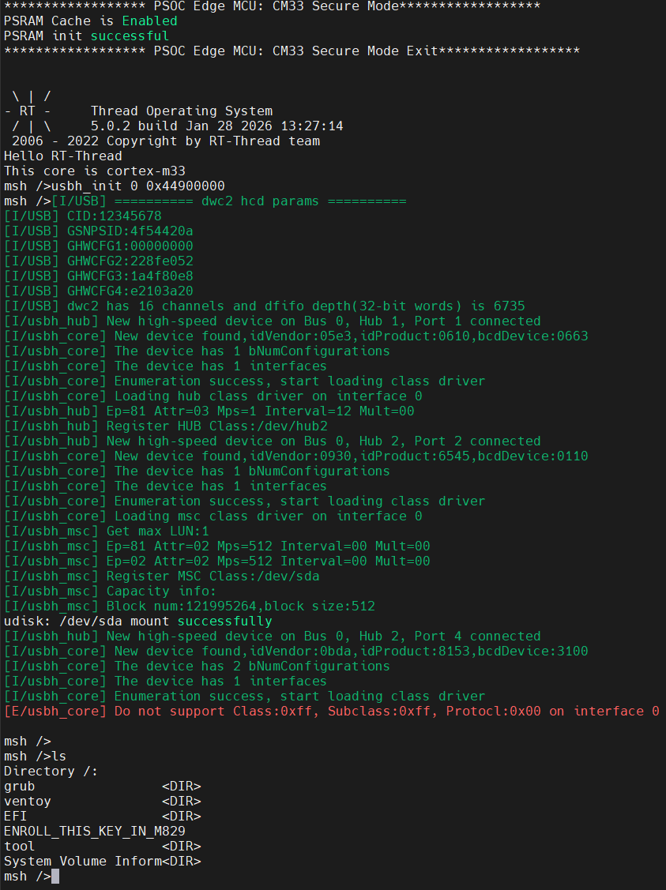

# Edgi_Talk_M55_USB_H CherryUSB Example Project

[**中文**](./README_zh.md) | **English**

## Overview

This project integrates **CherryUSB** on the **M55 core** of the Edgi-Talk board. It is configured for **USB host mode** and uses the Infineon **DWC2** IP.

## Default Configuration

* `RT_USING_CHERRYUSB = y`
* `RT_CHERRYUSB_HOST = y`
* `RT_CHERRYUSB_HOST_MSC = y`
* `RT_CHERRYUSB_HOST_DWC2_INFINEON = y`
* Host class drivers: **MSC, CDC, HID** (configurable)

## Build and Flash

1. Build the project in RT-Thread Studio or with SCons.
2. Flash the firmware via KitProg3 (DAP).
3. Connect USB devices to the Type-C USB port for host operation.

## Configuration (Switching Modes)

Open RT-Thread Studio and go to:

```
RT-Thread Settings -> USB -> CherryUSB
```

* **Host mode**: enable `RT_CHERRYUSB_HOST`, select host IP under **CHERRYUSB_HOST_IP** (default: `RT_CHERRYUSB_HOST_DWC2_INFINEON`).
* **Host classes**: enable required class drivers (MSC for USB storage, HID for keyboards/mice, CDC for serial devices, etc.).
* **Device mode**: disable host mode, enable `RT_CHERRYUSB_DEVICE`, and select device template.

If an IP/class requires extra parameters, edit:

* `libraries/Common/board/ports/usb/usb_config.h`

## USB U-Disk (Host) Result



## Notes

* This project targets the M55 core in USB host mode.
* For device mode, see [projects/Edgi_Talk_CherryUSB/Edgi_Talk_M55_USB_D/README.md](../Edgi_Talk_M55_USB_D/README.md).
* For M33 host mode, see [projects/Edgi_Talk_CherryUSB/Edgi_Talk_M33_USB_H/README.md](../Edgi_Talk_M33_USB_H/README.md).

## Startup Sequence

The M55 core depends on the M33 boot flow. Flash in this order:

```
+------------------+
|   Secure M33     |
|  (Secure Core)   |
+------------------+
          |
          v
+------------------+
|       M33        |
| (Non-Secure Core)|
+------------------+
          |
          v
+-------------------+
|       M55         |
| (Application Core)|
+-------------------+
```

## Notes

* If the M55 example does not run, flash **Edgi_Talk_M33_Blink_LED** first.
* Enable CM55 in the M33 project:

  ```
  RT-Thread Settings -> Hardware -> select SOC Multi Core Mode -> Enable CM55 Core
  ```
